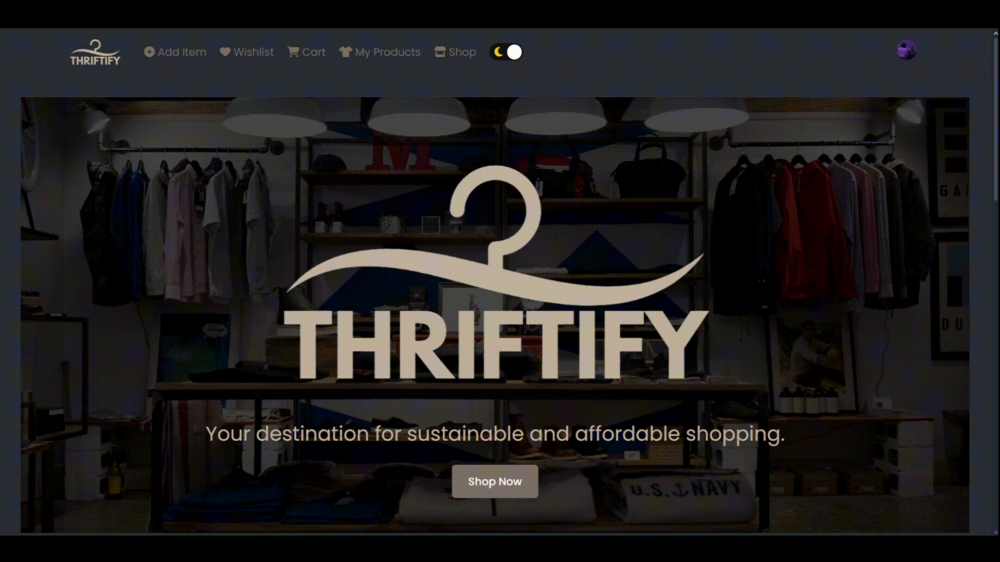
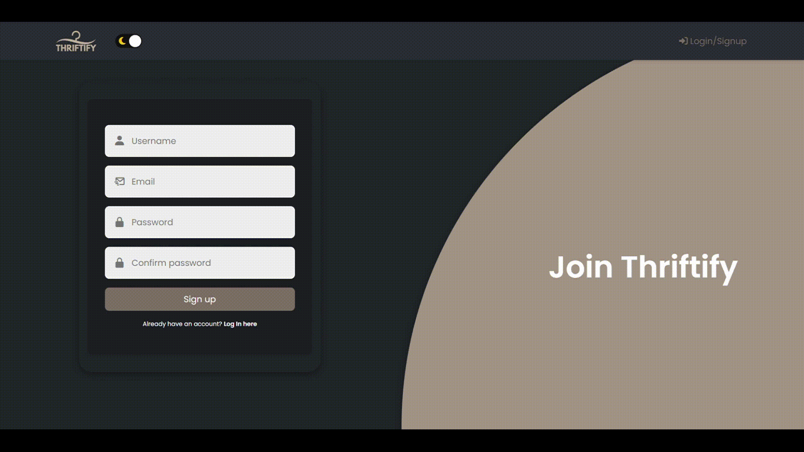
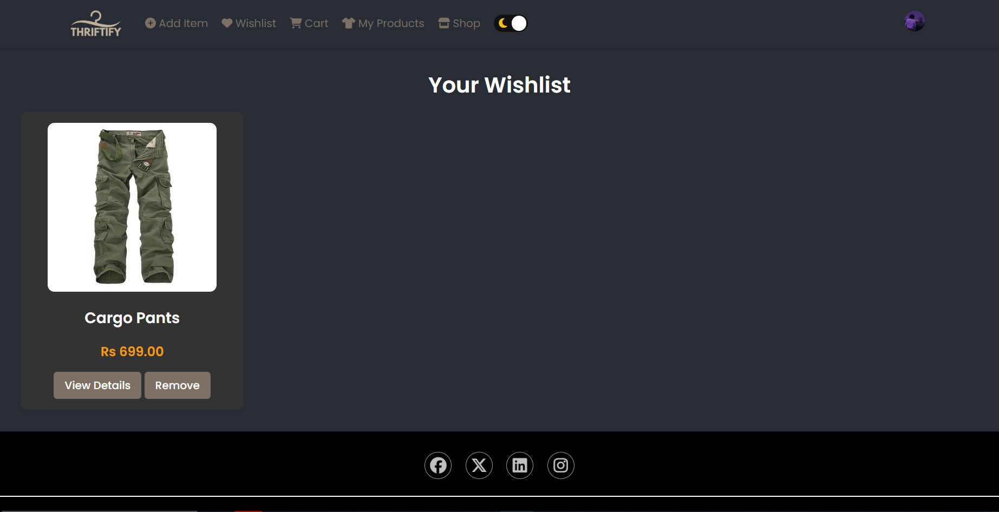
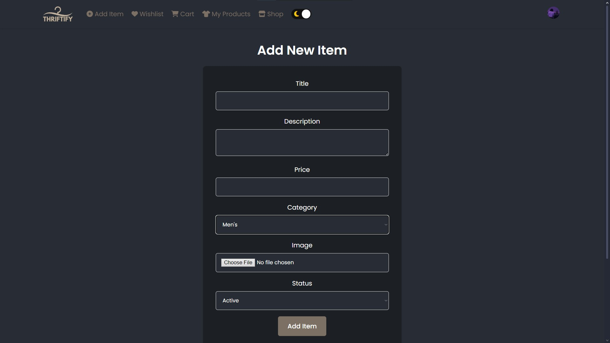
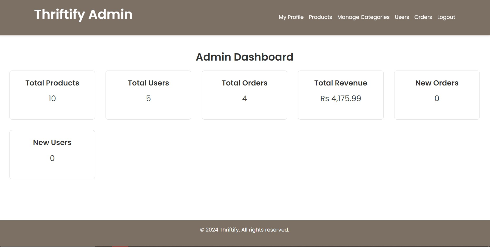
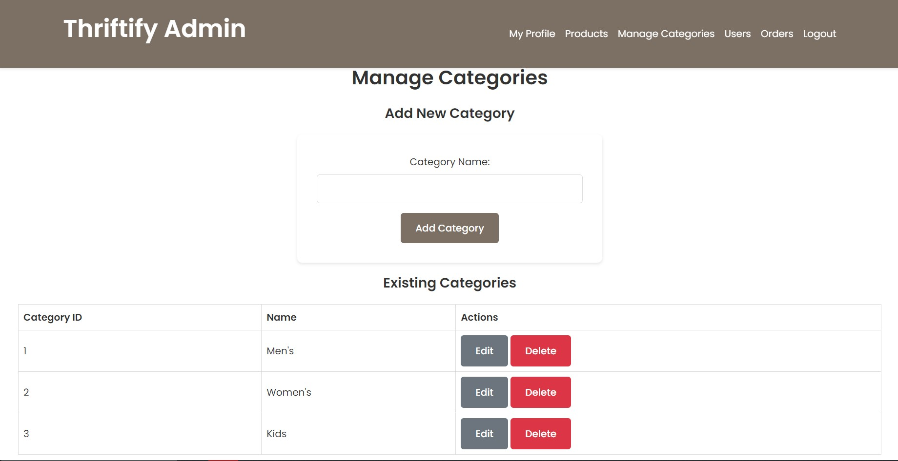
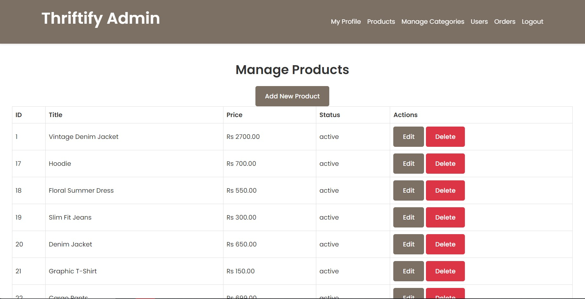
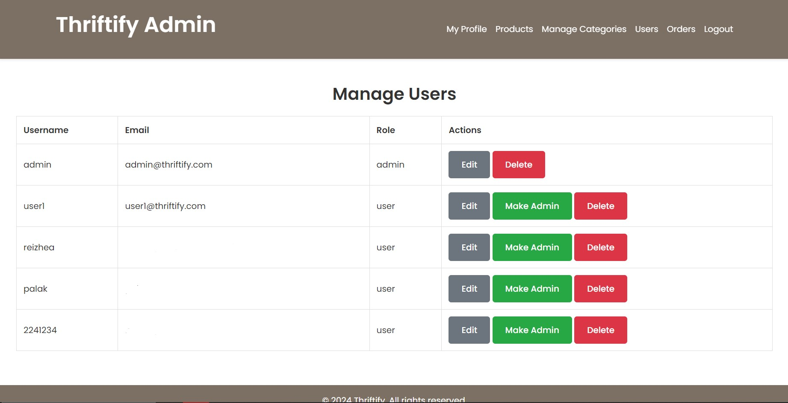
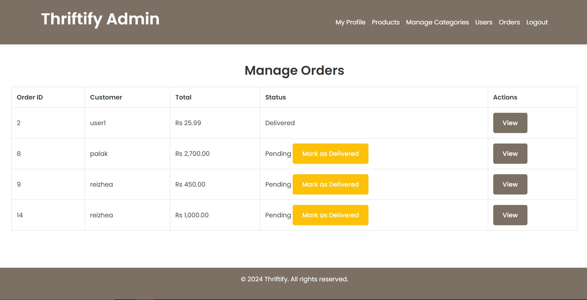

# Thriftify - Sustainable Shopping Platform

Thriftify is an innovative online platform promoting sustainable consumption through the sale and purchase of pre-owned clothes. The platform supports the United Nations Sustainable Development Goals (SDGs) by reducing waste, extending the lifecycle of products, and lowering carbon emissions associated with fast fashion.

## Key Features
- **User Features**:
  - User registration and login functionality.
  - Product catalog with search, filtering, and sorting options.
  - Shopping cart management.
  - Wishlist for saving favorite items.
  - Product reviews and ratings for informed decision-making.
  - User profile management with editable account details.

- **Admin Features**:
  - Admin dashboard for managing users, products, and orders.
  - Tools for reviewing and moderating product listings and user activity.

- **Sustainability Focus**:
  - Encourages reuse of products to reduce waste.
  - Promotes affordable and eco-friendly shopping options.
  - Aligns with SDG 12 (Responsible Consumption and Production) and SDG 13 (Climate Action).

## Technologies Used
- **Frontend**: HTML, CSS, JavaScript
- **Backend**: PHP
- **Database**: MySQL

## Demo Previews

### User Views

#### Dark-Light Mode


#### Login Page


#### Landing Page


#### Wishlist


#### Add Items


---

### Admin Views

#### Admin Dashboard


#### Manage Categories


#### Manage Products


#### Manage Users


#### Manage Orders



## Installation Instructions
1. Clone the repository:
   ```bash
   git clone https://github.com/your-username/Thriftify.git
   
2. Set up the MySQL database:
   - Import the `database.sql` file from the `/database` directory into your MySQL server.
   - Ensure the database is correctly configured with all required tables and relationships.

3. Configure the backend:
   - Open the `includes/config.php` file.
   - Update the database credentials (`host`, `username`, `password`, `database_name`) to match your MySQL setup.

4. Deploy the application:
   - Use a local server environment like XAMPP or WAMP.
   - Place the project files in the server’s root directory (e.g., `htdocs` for XAMPP).
   - Start the server and access the application by navigating to `http://localhost/Thriftify` in your web browser.

## Testing
- **Unit Testing**: Verified the functionality of individual modules, such as user authentication, product management, and checkout.
- **Functional Testing**: Confirmed that all features, including wishlist, cart management, and order processing, met user requirements.
- **Integration Testing**: Ensured seamless communication between the frontend, backend, and database for reliable performance.

## Authors
- **Nawang Dorjee**
